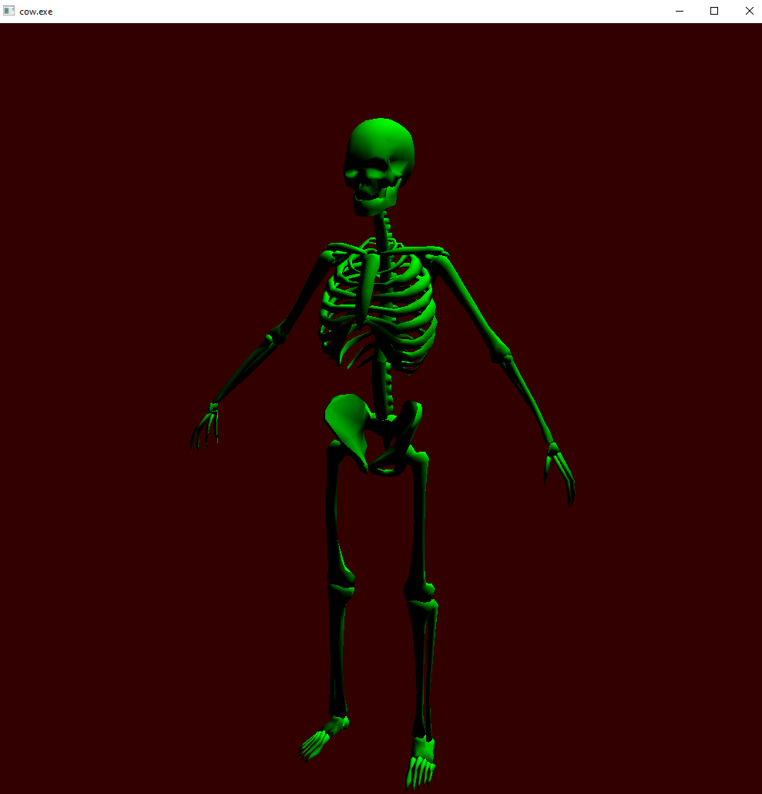
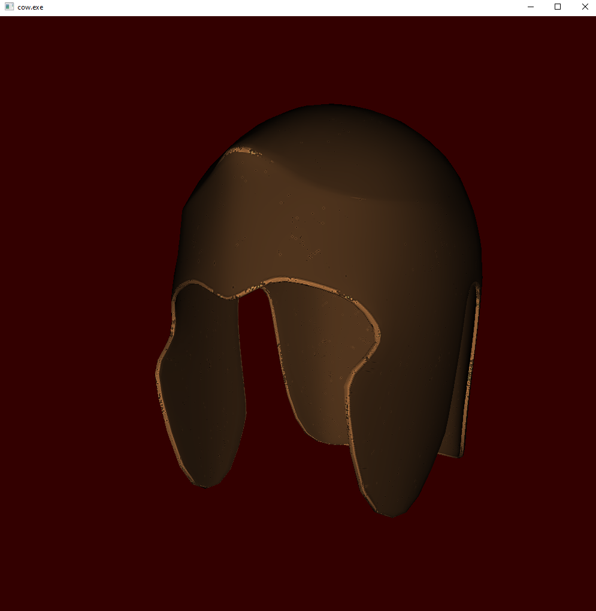
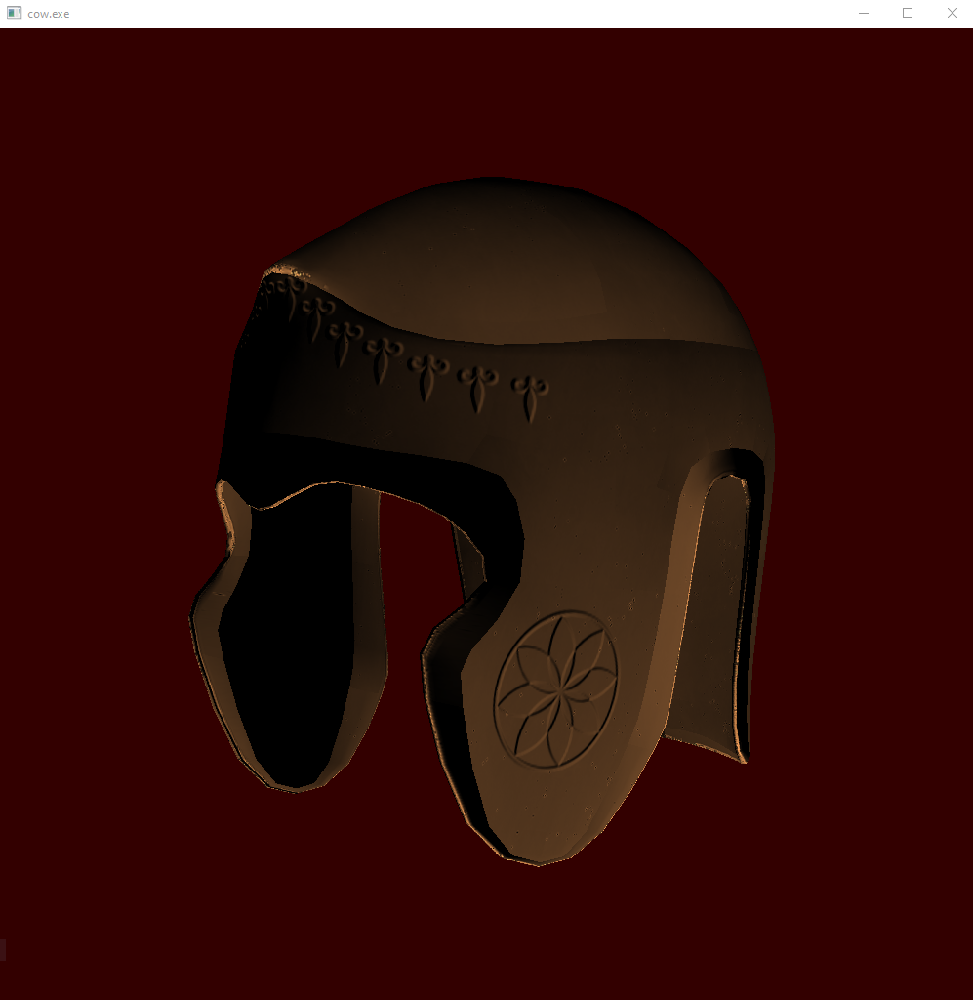
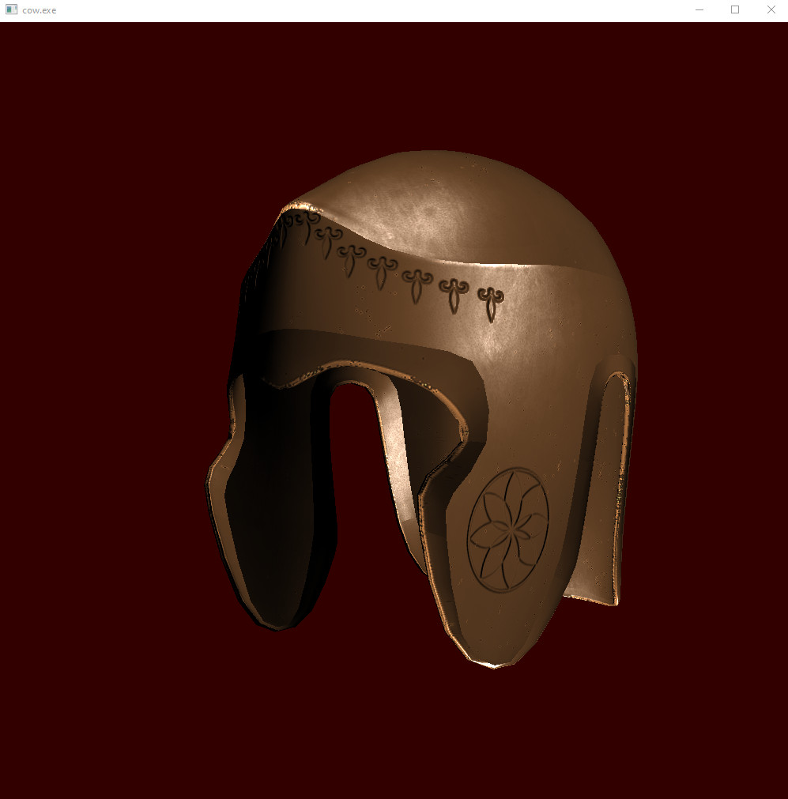
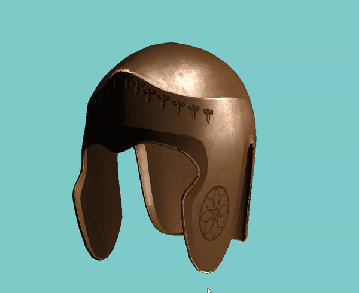
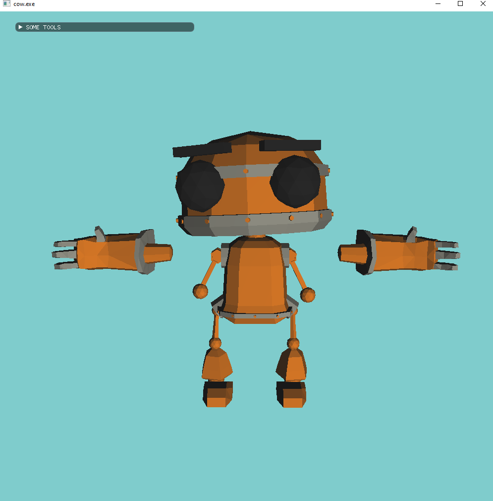

## FBX Loader w/ OpenGL viewer

#### Changelog

- V1 - 20 Sept 20
    - multi-mesh objects can be loaded w/ normals
    

- V2 - 24 Sept 20
    - Diffuse and Normal Maps have been added
    - Fixed lighting

  <table>
    <tr>
      <td>Diffuse</td>
      <td>Normal Map</td>
      <td>Normal Map w/ specular</td>
    </tr>
    <tr>
      <td></td>
      <td></td>
      <td></td>
    </tr>
  </table>

  

- V2.1 - 25 Sept 20
    - fixed normal and tanget generation

- V2.2 - 27 Sept 20
    - objects with multiple materials per mesh and no textures can now be loaded

    

#### To Be Added

- ~~Texture Loading~~
- ~~Materials~~
- Bone Hierarchy
- Animations

#### Known Bugs

- ~~Lighting seems a little off when using normal maps~~

